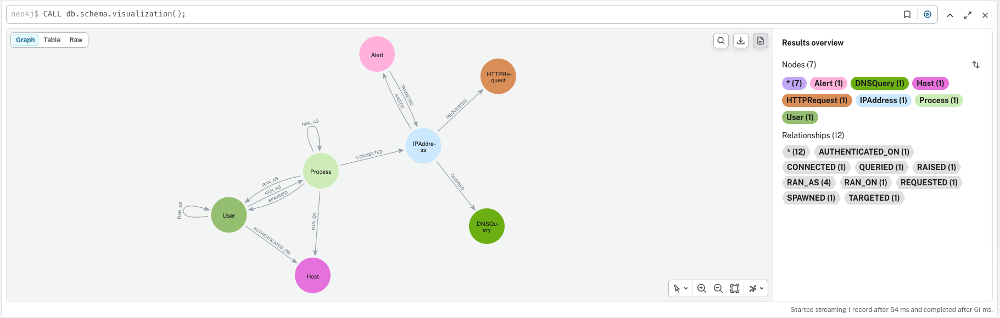
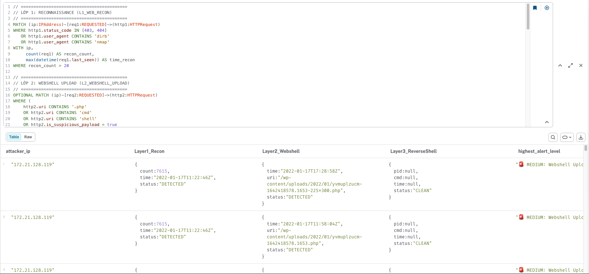
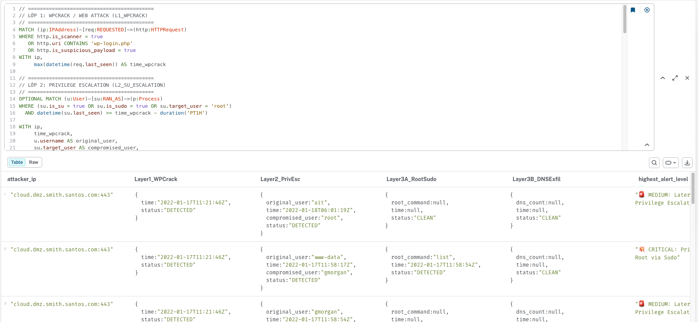
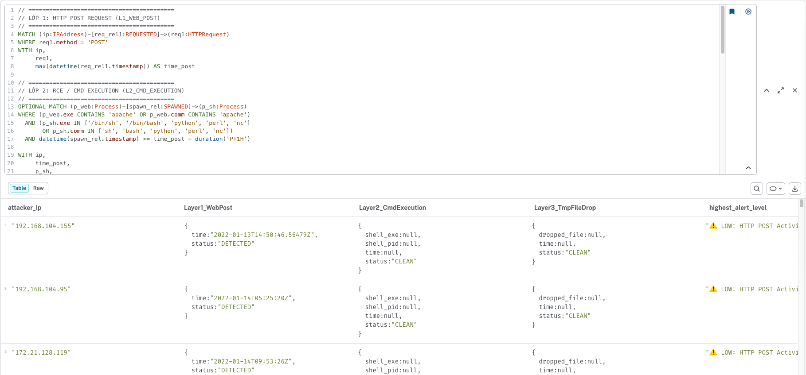
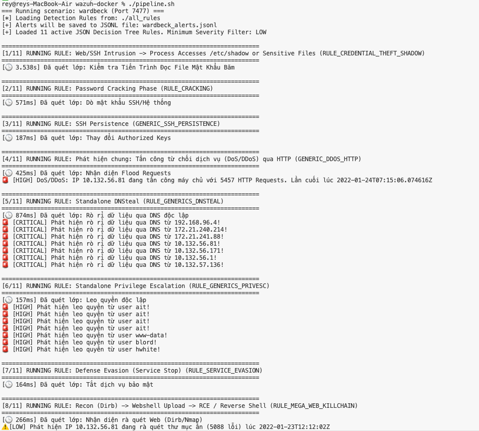
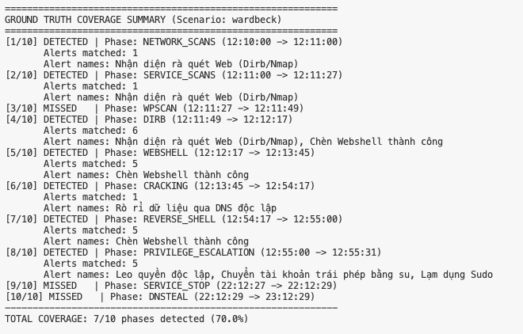
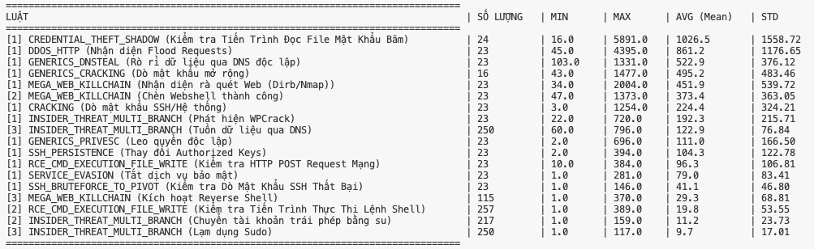

# Phát hiện xâm nhập trái phép dựa trên phân tích đa nguồn dữ liệu

Hệ thống phát hiện xâm nhập tập trung vào việc thu thập, phân tích và tương quan các sự kiện bảo mật từ nhiều nguồn log khác nhau bằng việc kết hợp Engine tự viết cùng Cơ sở dữ liệu đồ thị (Neo4j) để mở rộng các hệ thống SIEM đang có (Wazuh, ...).

## Kiến trúc

Hệ thống được thiết kế theo mô hình xử lý đường ống dữ liệu theo thời gian thực, bao gồm các thành phần:

1. **Wazuh (SIEM / XDR):** Nền tảng dùng để cấu hình giám sát các nút (agent), thu thập các sự kiện bảo mật.
2. **Vector:** Công cụ định tuyến log làm nhiệm vụ thu thập log thô từ máy chủ và các tệp JSON của Wazuh, sau đó đẩy liên tục về một Webhook.
3. **Go Webhook Middleware:** Mã nguồn tùy chỉnh được viết bằng ngôn ngữ Golang (`cmd/aaa/webhook.go`). Bao gồm bộ phân tích cú pháp + engine phát hiện xâm nhập. Hệ thống hỗ trợ:
   - `auth.log` / `syslog` (log Xác thực hệ thống & Phân quyền)
   - `apache_access.log` (log Webserver)
   - `eve.json` (log từ Suricata IDS)
   - `audit.log` (log Hệ điều hành)
4. **Neo4j Graph DB:** Đóng vai trò là trung tâm xử lý tương quan sự kiện . Log được chuyển đổi thành Đồ thị tri thức với các Nút (IP, User, Process, ...) và Cạnh (Hành vi).

## Bộ dữ liệu Thực nghiệm (Dataset)

Dự án sử dụng bộ dữ liệu **AIT-LDS v2.1 (Austrian Institute of Technology Log Data Set)**.
Các tệp dữ liệu được lưu trong cùng với ground truth là folder `ait_ads/`, mô phỏng các kịch bản tấn công theo vòng đời (Kill-chain) hoàn chỉnh từ MITRE ATT&CK:
- Dò thám & Rà quét (`network_scans`, `wpscan`, `dirb`)
- Xâm nhập bước đầu (`webshell`)
- Chiếm quyền và leo thang (`cracking`, `su/sudo`)
- Tuồn dữ liệu ra ngoài (`dnsteal`)

Các kịch bản được thử nghiệm: `russellmitchell`, `santos`, `fox`, `wardbeck`.

<!-- ## Thực nghiệm

### 1. Yêu cầu hệ thống
- Docker & Docker Compose
- Golang (phiên bản >= 1.20)
- Ít nhất 4GB RAM trống cho các container (Wazuh, Neo4j, v.v.)

### 2. Triển khai Hệ thống Cơ sở
Sử dụng Docker Compose để khởi tạo cụm Wazuh (Single-node) và các thành phần đi kèm:

```bash
cd single-node
docker-compose up -d
```

### 3. Khởi chạy Webhook Xử lý Đa Nguồn
Để khởi chạy middleware trung gian nhận log từ Vector và đẩy dữ liệu vào Neo4j:

```bash
cd cmd/aaa
go run webhook.go
```
*Lưu ý: Cần đảm bảo cơ sở dữ liệu Neo4j đang chạy và thông tin xác thực (`neo4jURL`, `neo4jUser`, `neo4jPass`) đã được cấu hình đúng.* -->

## Phân tích và Truy vấn Đồ thị

Thay vì viết các quy tắc (Rules) dò tìm trên log phẳng, hệ thống sử dụng ngôn ngữ truy vấn **Cypher** để tìm kiếm chuỗi tấn công thông qua mô hình đồ thị. Dưới đây là bộ truy vấn tiêu biểu phục vụ cho việc bóc tách kịch bản tấn công leo thang đặc quyền:

**Trực quan hóa toàn bộ Lược đồ Đồ thị (Graph Schema)**
```cypher
CALL db.schema.visualization();
```


```cypher
// ==========================================
// LỚP 1: RECONNAISSANCE (L1_WEB_RECON)
// ==========================================
MATCH (ip:IPAddress)-[req1:REQUESTED]->(http1:HTTPRequest)
WHERE http1.status_code IN [403, 404] 
   OR http1.user_agent CONTAINS 'dirb' 
   OR http1.user_agent CONTAINS 'nmap'
WITH ip, 
     count(req1) AS recon_count, 
     max(datetime(req1.last_seen)) AS time_recon
WHERE recon_count > 20

// ==========================================
// LỚP 2: WEBSHELL UPLOAD (L2_WEBSHELL_UPLOAD)
// ==========================================
OPTIONAL MATCH (ip)-[req2:REQUESTED]->(http2:HTTPRequest)
WHERE (
    http2.uri CONTAINS '.php' 
    OR http2.uri CONTAINS 'cmd' 
    OR http2.uri CONTAINS 'shell' 
    OR http2.is_suspicious_payload = true 
    OR http2.method = 'POST'
  )
  AND http2.status_code IN [200, 201, 302, 404]
  AND datetime(req2.timestamp) >= time_recon - duration('PT2H')

WITH ip, 
     recon_count, 
     time_recon, 
     http2.uri AS webshell_uri, 
     max(datetime(req2.timestamp)) AS time_webshell

// ==========================================
// LỚP 3: REVERSE SHELL (L3_REVERSE_SHELL)
// ==========================================
OPTIONAL MATCH (p_web:Process)-[s:SPAWNED]->(p_shell:Process)
WHERE (
    p_web.exe CONTAINS 'apache' 
    OR p_web.comm CONTAINS 'apache' 
    OR p_web.exe CONTAINS 'nginx' 
    OR p_web.exe CONTAINS 'php'
  )
  AND (
    p_shell.exe CONTAINS 'bash' 
    OR p_shell.exe CONTAINS 'sh' 
    OR p_shell.exe CONTAINS 'nc' 
    OR p_shell.exe CONTAINS 'python' 
    OR p_shell.exe CONTAINS 'perl' 
    OR p_shell.comm CONTAINS 'sh' 
    OR p_shell.comm CONTAINS 'bash'
  )
  // Chỉ lọc L3 nếu đã ghi nhận mốc thời gian của L2
  AND time_webshell IS NOT NULL 
  AND datetime(s.timestamp) >= time_webshell - duration('PT1H')

WITH ip, recon_count, time_recon, webshell_uri, time_webshell,
     p_shell.exe AS shell_cmd, p_shell.pid AS shell_pid, max(datetime(s.timestamp)) AS time_revshell

// ==========================================
// TỔNG HỢP VÀ ĐÁNH GIÁ
// ==========================================
RETURN 
  ip.ip AS attacker_ip,
  
  // Thông tin Lớp 1
  {
    status: CASE WHEN time_recon IS NOT NULL THEN 'DETECTED' ELSE 'CLEAN' END,
    count: recon_count,
    time: toString(time_recon)
  } AS Layer1_Recon,

  // Thông tin Lớp 2
  {
    status: CASE WHEN time_webshell IS NOT NULL THEN 'DETECTED' ELSE 'CLEAN' END,
    uri: webshell_uri,
    time: toString(time_webshell)
  } AS Layer2_Webshell,

  // Thông tin Lớp 3
  {
    status: CASE WHEN time_revshell IS NOT NULL THEN 'DETECTED' ELSE 'CLEAN' END,
    cmd: shell_cmd,
    pid: shell_pid,
    time: toString(time_revshell)
  } AS Layer3_ReverseShell,

  // Cảnh báo cao nhất đạt được
  CASE 
    WHEN time_revshell IS NOT NULL THEN '💥 CRITICAL: Full Kill Chain Executed'
    WHEN time_webshell IS NOT NULL THEN '🚨 MEDIUM: Webshell Uploaded'
    ELSE '⚠️ LOW: Reconnaissance Only'
  END AS highest_alert_level

ORDER BY time_recon ASC;
```



```cypher
// ==========================================
// LỚP 1: WPCRACK / WEB ATTACK (L1_WPCRACK)
// ==========================================
MATCH (ip:IPAddress)-[req:REQUESTED]->(http:HTTPRequest)
WHERE http.is_scanner = true 
   OR http.uri CONTAINS 'wp-login.php' 
   OR http.is_suspicious_payload = true
WITH ip, 
     max(datetime(req.last_seen)) AS time_wpcrack

// ==========================================
// LỚP 2: PRIVILEGE ESCALATION (L2_SU_ESCALATION)
// ==========================================
OPTIONAL MATCH (u:User)-[su:RAN_AS]->(p:Process)
WHERE (su.is_su = true OR su.is_sudo = true OR su.target_user = 'root')
  AND datetime(su.last_seen) >= time_wpcrack - duration('PT1H')

WITH ip, 
     time_wpcrack, 
     u.username AS original_user, 
     su.target_user AS compromised_user, 
     max(datetime(su.last_seen)) AS time_su

// ==========================================
// LỚP 3A: SUDO (L3A_ROOT_SUDO)
// ==========================================
OPTIONAL MATCH (u_comp:User {username: compromised_user})-[sudo:RAN_AS {is_sudo: true}]->(p_root:Process)
WHERE time_su IS NOT NULL 
  AND datetime(sudo.last_seen) >= time_su

WITH ip, time_wpcrack, original_user, compromised_user, time_su,
     sudo.command AS root_command, 
     max(datetime(sudo.last_seen)) AS time_sudo

// ==========================================
// LỚP 3B: DỮ LIỆU QUA DNS (L3B_DNS_EXFIL)
// ==========================================
OPTIONAL MATCH (ip)-[q:QUERIED]->(dns:DNSQuery)
WHERE size(dns.rrname) > 40 
  AND time_su IS NOT NULL 
  AND datetime(q.last_seen) >= time_su

WITH ip, time_wpcrack, original_user, compromised_user, time_su, 
     root_command, time_sudo,
     count(q) AS dns_count, 
     max(datetime(q.last_seen)) AS time_dns

// Lọc lại L3B nếu không đủ ngưỡng > 5 gói DNS query
WITH ip, time_wpcrack, original_user, compromised_user, time_su, 
     root_command, time_sudo,
     CASE WHEN dns_count > 5 THEN dns_count ELSE NULL END AS exfil_dns_count,
     CASE WHEN dns_count > 5 THEN time_dns ELSE NULL END AS exfil_time_dns

// ==========================================
// TỔNG HỢP VÀ BÁO CÁO TRẠNG THÁI TỪNG LỚP
// ==========================================
RETURN 
  ip.ip AS attacker_ip,
  
  // Trạng thái Lớp 1
  {
    status: CASE WHEN time_wpcrack IS NOT NULL THEN 'DETECTED' ELSE 'CLEAN' END,
    time: toString(time_wpcrack)
  } AS Layer1_WPCrack,

  // Trạng thái Lớp 2
  {
    status: CASE WHEN time_su IS NOT NULL THEN 'DETECTED' ELSE 'CLEAN' END,
    original_user: original_user,
    compromised_user: compromised_user,
    time: toString(time_su)
  } AS Layer2_PrivEsc,

  // Trạng thái Nhánh Lớp 3A
  {
    status: CASE WHEN time_sudo IS NOT NULL THEN 'DETECTED' ELSE 'CLEAN' END,
    root_command: root_command,
    time: toString(time_sudo)
  } AS Layer3A_RootSudo,

  // Trạng thái Nhánh Lớp 3B
  {
    status: CASE WHEN exfil_time_dns IS NOT NULL THEN 'DETECTED' ELSE 'CLEAN' END,
    dns_count: exfil_dns_count,
    time: toString(exfil_time_dns)
  } AS Layer3B_DNSExfil,

  // Đánh giá
  CASE 
    WHEN time_sudo IS NOT NULL AND exfil_time_dns IS NOT NULL 
         THEN '💥💥 CRITICAL: Full Multi-Branch Exploit (Root Sudo & DNS Exfiltration)'
    WHEN time_sudo IS NOT NULL 
         THEN '💥 CRITICAL: Privilege Escalation to Root via Sudo'
    WHEN exfil_time_dns IS NOT NULL 
         THEN '💥 HIGH: Data Exfiltration via DNS Tunneling'
    WHEN time_su IS NOT NULL 
         THEN '🚨 MEDIUM: Lateral Movement / Privilege Escalation'
    ELSE '⚠️ LOW: Web Scanning / Brute-force'
  END AS highest_alert_level

ORDER BY time_wpcrack ASC;
```


```cypher
// ==========================================
// LỚP 1: HTTP POST REQUEST (L1_WEB_POST)
// ==========================================
MATCH (ip:IPAddress)-[req_rel1:REQUESTED]->(req1:HTTPRequest)
WHERE req1.method = 'POST'
WITH ip, 
     req1,
     max(datetime(req_rel1.timestamp)) AS time_post

// ==========================================
// LỚP 2: RCE / CMD EXECUTION (L2_CMD_EXECUTION)
// ==========================================
OPTIONAL MATCH (p_web:Process)-[spawn_rel:SPAWNED]->(p_sh:Process)
WHERE (p_web.exe CONTAINS 'apache' OR p_web.comm CONTAINS 'apache')
  AND (p_sh.exe IN ['/bin/sh', '/bin/bash', 'python', 'perl', 'nc'] 
       OR p_sh.comm IN ['sh', 'bash', 'python', 'perl', 'nc'])
  AND datetime(spawn_rel.timestamp) >= time_post - duration('PT1H')

WITH ip, 
     time_post, 
     p_sh,
     p_sh.exe AS sh_exe, 
     p_sh.pid AS sh_pid, 
     max(datetime(spawn_rel.timestamp)) AS time_rce

// ==========================================
// LỚP 3: FILE DROP IN /tmp (L3_TMP_FILE_DROP)
// ==========================================
OPTIONAL MATCH (p_sh)-[:SPAWNED|EXECUTED*0..3]->(p2:Process)-[w:WRITE]->(f:File)
WHERE time_rce IS NOT NULL
  AND (f.path STARTS WITH '/tmp/' OR f.path STARTS WITH '/var/tmp/')

WITH ip, time_post, sh_exe, sh_pid, time_rce,
     f.path AS dropped_file, 
     max(datetime(w.timestamp)) AS time_drop

// ==========================================
// TỔNG HỢP VÀ ĐÁNH GIÁ
// ==========================================
RETURN 
  ip.ip AS attacker_ip,

  // Thông tin Lớp 1
  {
    status: CASE WHEN time_post IS NOT NULL THEN 'DETECTED' ELSE 'CLEAN' END,
    time: toString(time_post)
  } AS Layer1_WebPost,

  // Thông tin Lớp 2
  {
    status: CASE WHEN time_rce IS NOT NULL THEN 'DETECTED' ELSE 'CLEAN' END,
    shell_exe: sh_exe,
    shell_pid: sh_pid,
    time: toString(time_rce)
  } AS Layer2_CmdExecution,

  // Thông tin Lớp 3
  {
    status: CASE WHEN time_drop IS NOT NULL THEN 'DETECTED' ELSE 'CLEAN' END,
    dropped_file: dropped_file,
    time: toString(time_drop)
  } AS Layer3_TmpFileDrop,

  // Mức cảnh báo cao nhất
  CASE 
    WHEN time_drop IS NOT NULL THEN '🚨 CRITICAL: Malware Dropped to /tmp via RCE'
    WHEN time_rce IS NOT NULL THEN '💥 HIGH: Remote Command Execution (RCE)'
    ELSE '⚠️ LOW: HTTP POST Activity'
  END AS highest_alert_level

ORDER BY time_post ASC;
```


## Đánh giá

#### Quét xâm nhập


#### Độ bao phủ


#### Độ trễ query

