# Hệ Thống Tập Luật Đa Nguồn (all_rules)

Dưới đây là lưu đồ tự động tạo cho các tập luật trong thư mục này.

## RULE_CRACKING: Password Cracking Phase
**File:** `rule_cracking.json`

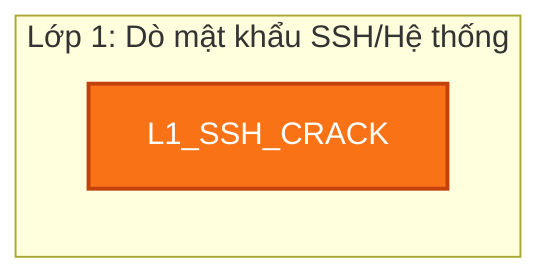

## RULE_CREDENTIAL_THEFT_SHADOW: Web/SSH Intrusion -> Process Accesses /etc/shadow or Sensitive Files
**File:** `rule_credential_theft.json`

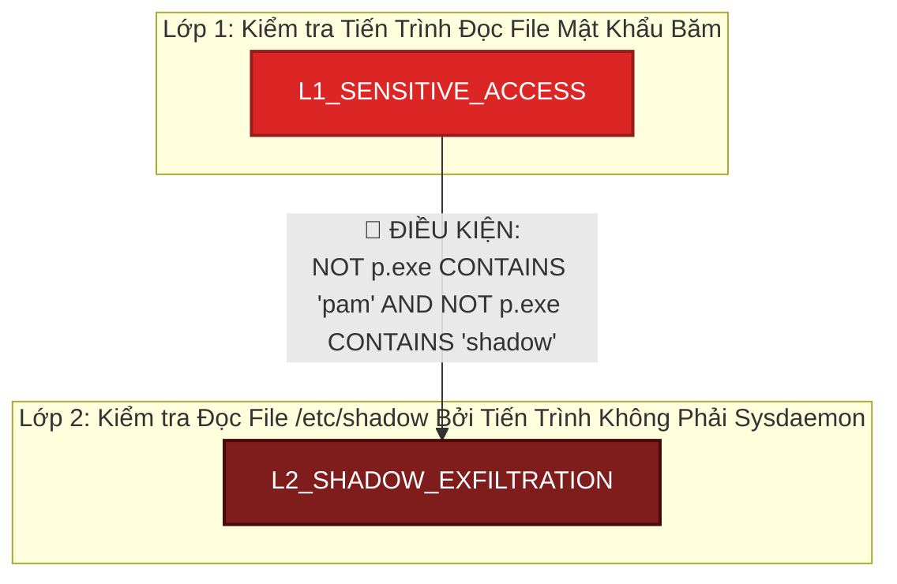

## GENERIC_DATA_STAGING: Phát hiện chung: Đóng gói dữ liệu chuẩn bị tuồn ra ngoài (Data Staging)
**File:** `rule_generic_data_staging.json`

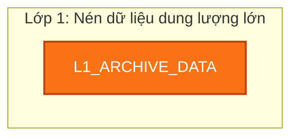

## GENERIC_DDOS_HTTP: Phát hiện chung: Tấn công từ chối dịch vụ (DoS/DDoS) qua HTTP
**File:** `rule_generic_ddos.json`

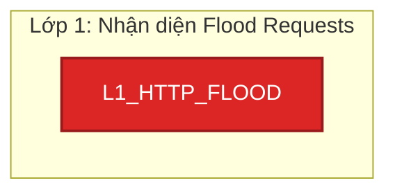

## GENERIC_DEFENSE_EVASION: Phát hiện chung: Xóa dấu vết / Che giấu hành vi (Defense Evasion)
**File:** `rule_generic_defense_evasion.json`

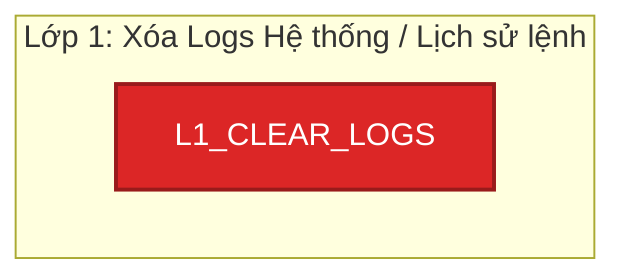

## GENERIC_DATA_EXFILTRATION: Phát hiện chung: Tuồn dữ liệu ra ngoài (Data Exfiltration)
**File:** `rule_generic_exfiltration.json`

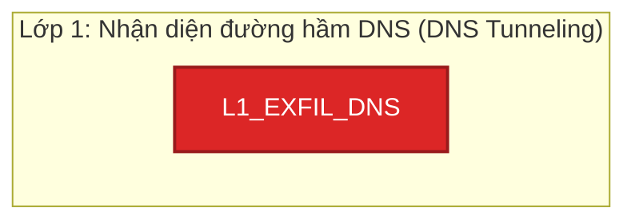

## GENERIC_FIM_PERSISTENCE: Phát hiện chung: Mã độc chạy ngầm -> Sửa đổi file hệ thống -> Gọi về máy chủ C2
**File:** `rule_generic_fim_persistence.json`

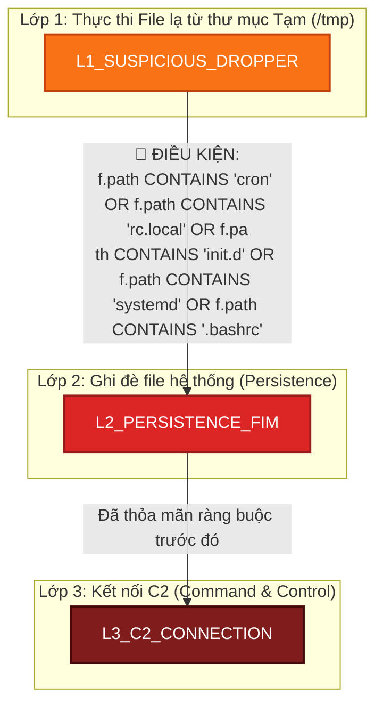

## GENERIC_LOLBIN_DOWNLOAD: Phát hiện chung: Lạm dụng công cụ hệ thống (LoLBin) để tải mã độc
**File:** `rule_generic_lolbin_download.json`

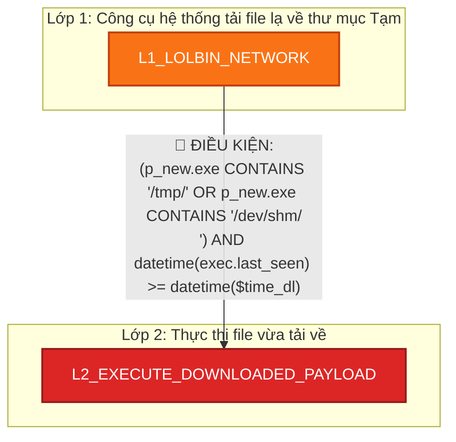

## GENERIC_PASSWORD_CRACKING: Phát hiện chung: Password Cracking / Brute-force
**File:** `rule_generic_password_cracking.json`

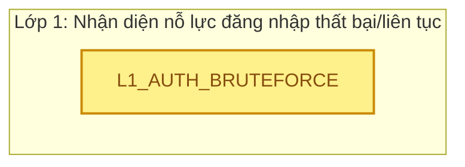

## GENERIC_PORT_SCAN: Phát hiện chung: Quét cổng mạng (Network Port Scanning)
**File:** `rule_generic_port_scan.json`

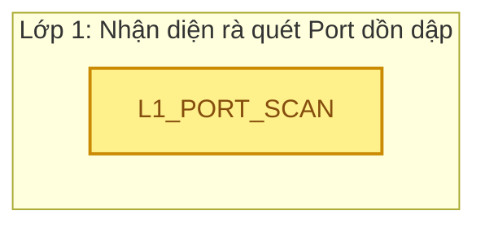

## GENERIC_PRIVILEGE_ESCALATION: Phát hiện chung: Leo thang đặc quyền (su/sudo)
**File:** `rule_generic_privilege_escalation.json`

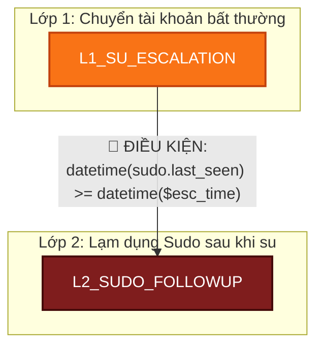

## GENERIC_RCE: Phát hiện chung: Thực thi lệnh từ xa (Remote Command Execution)
**File:** `rule_generic_rce.json`

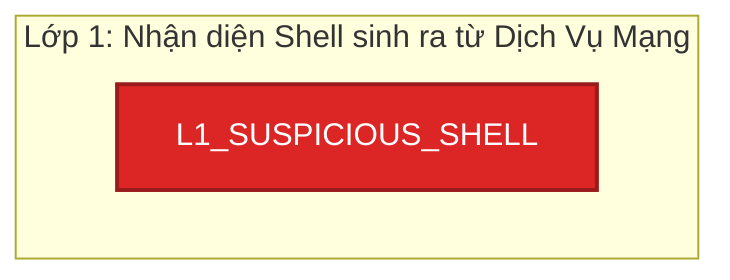

## GENERIC_REVERSE_SHELL: Phát hiện chung: Bắt tay ngược (Reverse Shell) ra ngoài Internet
**File:** `rule_generic_reverse_shell.json`

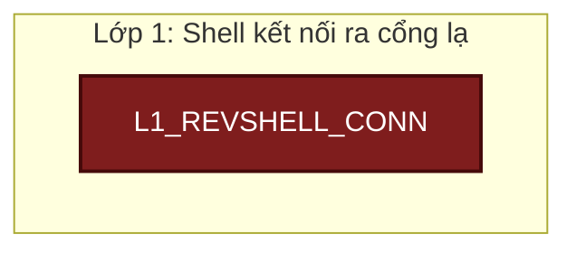

## GENERIC_ROOTKIT_MODULE: Phát hiện chung: Tải Module Nhân hệ điều hành (Rootkit/Kernel Module)
**File:** `rule_generic_rootkit_module.json`

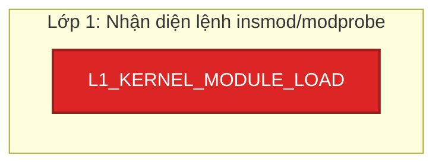

## GENERIC_SCANS: Phát hiện chung: Quét mạng và dò thám (Nmap, WPScan, Dirb...)
**File:** `rule_generic_scans.json`

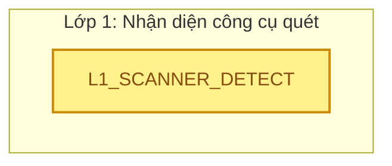

## GENERIC_SQLI_DUMP: Phát hiện chung: Tấn công SQL Injection (SQLi) -> Đánh cắp cơ sở dữ liệu (Database Dump)
**File:** `rule_generic_sqli_dump.json`

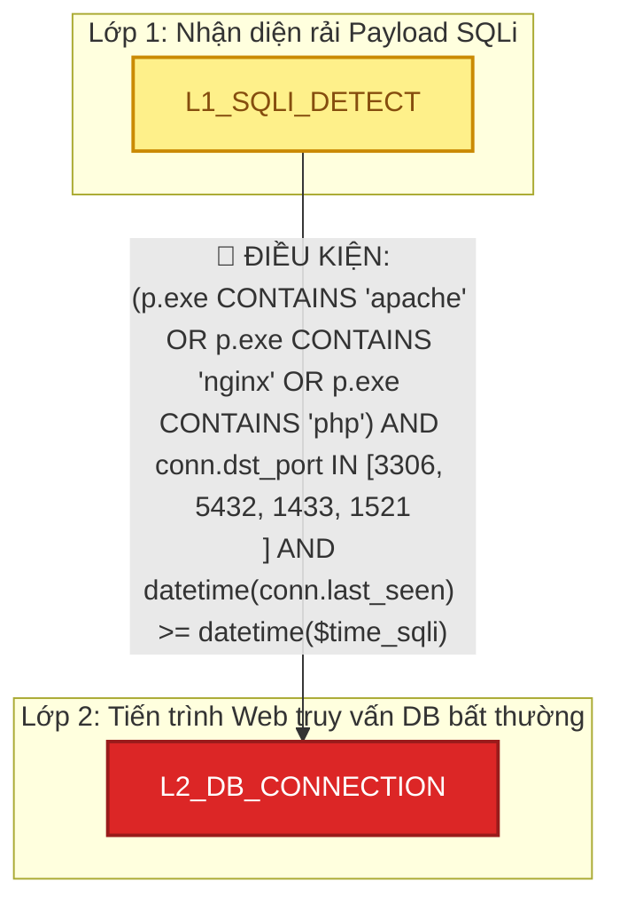

## GENERIC_SSH_BRUTEFORCE_PIVOT: Phát hiện chung: SSH Brute-force -> Đăng nhập thành công -> Tấn công lan truyền (Lateral Movement)
**File:** `rule_generic_ssh_bruteforce_pivot.json`

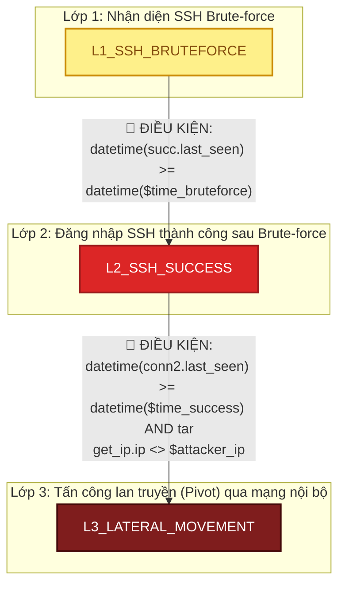

## GENERIC_SSH_PERSISTENCE: Phát hiện chung: Cấy khóa SSH trái phép (SSH Persistence)
**File:** `rule_generic_ssh_persistence.json`

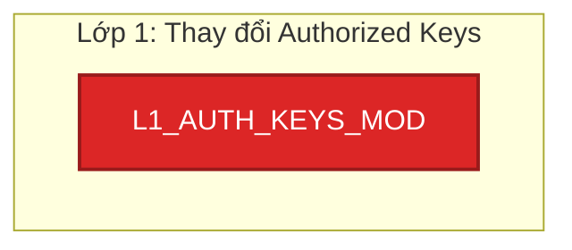

## GENERIC_SUDO_ABUSE: Phát hiện chung: Lạm dụng Sudo / Đặc quyền quản trị viên
**File:** `rule_generic_suspicious_sudo.json`

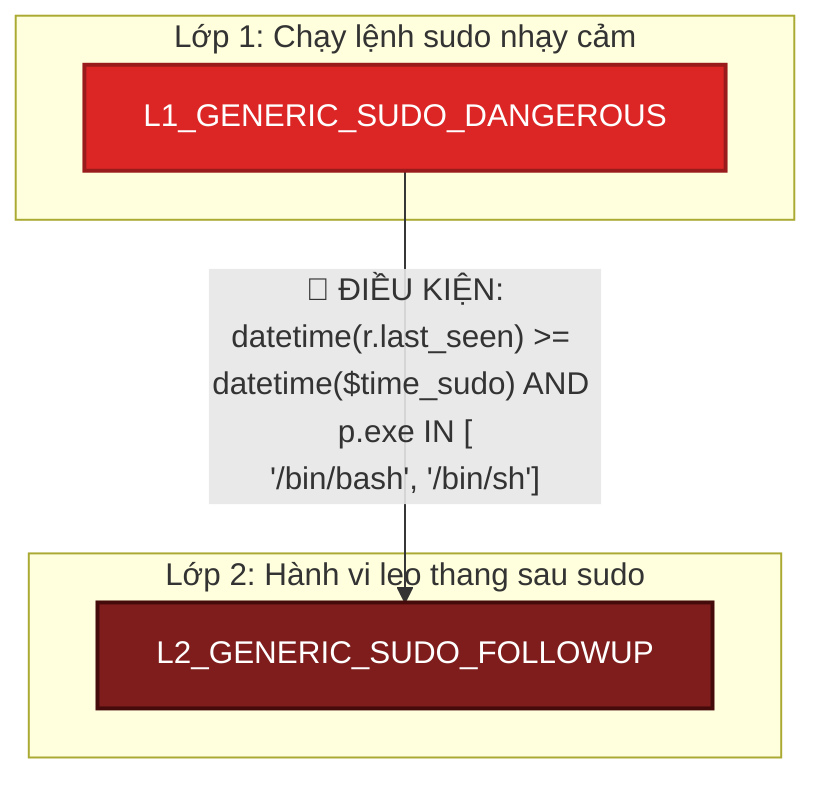

## GENERIC_WEB_TO_RCE: Phát hiện chung: Tấn công Web (Quét/Payload) -> Leo quyền (Webshell/RCE)
**File:** `rule_generic_web_rce.json`

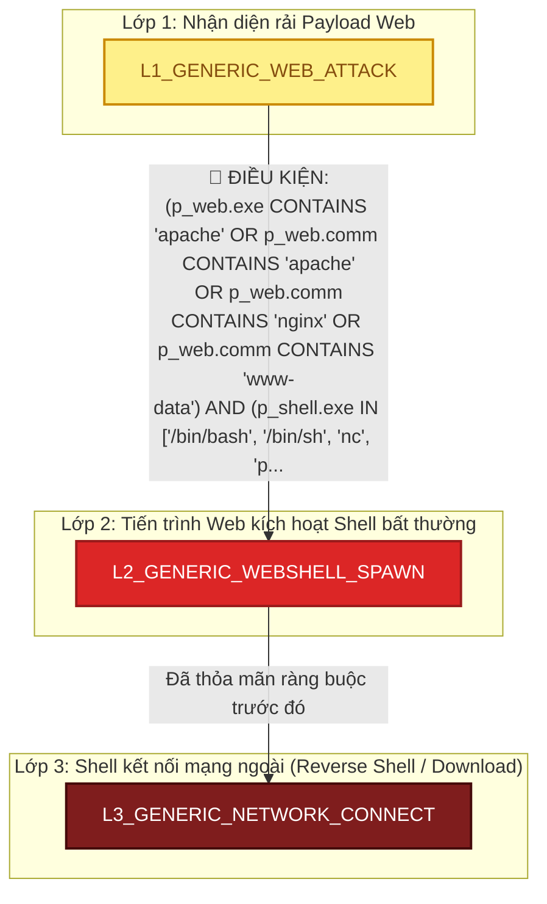

## GENERIC_WEB_RECON_TO_RCE: Phát hiện chung: Rà quét thư mục ẩn (404/403) -> Chèn Payload thành công (200) -> Kích hoạt RCE Shell
**File:** `rule_generic_web_recon_payload.json`

```mermaid
graph TD
    classDef low fill:#fef08a,stroke:#ca8a04,stroke-width:2px,color:#854d0e;
    classDef medium fill:#f97316,stroke:#c2410c,stroke-width:2px,color:#fff;
    classDef high fill:#dc2626,stroke:#991b1b,stroke-width:2px,color:#fff;
    classDef critical fill:#7f1d1d,stroke:#450a0a,stroke-width:2px,color:#fff;

    subgraph Layer1 ["Lớp 1: Nhận diện rà quét Web diện rộng"]
        L1_WEB_RECON["L1_WEB_RECON"]:::low
    end
    subgraph Layer2 ["Lớp 2: Chèn Payload thành công (HTTP 200)"]
        L2_PAYLOAD_SUCCESS["L2_PAYLOAD_SUCCESS"]:::medium
    end
    L1_WEB_RECON -->|"📝 ĐIỀU KIỆN:<br/>http2.status_code = 200 AND http2.is_suspicious_payload = tr<br/>ue AND datetime(req2.last_seen) >= datetime($time_recon)"| L2_PAYLOAD_SUCCESS
    subgraph Layer3 ["Lớp 3: Kích hoạt RCE Shell"]
        L3_RCE_EXEC["L3_RCE_EXEC"]:::critical
    end
    L2_PAYLOAD_SUCCESS -->|"📝 ĐIỀU KIỆN:<br/>(p_web.exe CONTAINS 'apache' OR p_web.comm CONTAINS 'www-dat<br/>a') AND p_shell.exe IN ['/bin/bash', '/bin/sh', 'nc', 'perl'<br/>, 'python', 'curl', 'wget'] AND datetime(spawn.last_seen) >=..."| L3_RCE_EXEC
```

## GENERIC_WEBSHELL_UPLOAD: Phát hiện chung: Tải Webshell lên máy chủ
**File:** `rule_generic_webshell_upload.json`

```mermaid
graph TD
    classDef low fill:#fef08a,stroke:#ca8a04,stroke-width:2px,color:#854d0e;
    classDef medium fill:#f97316,stroke:#c2410c,stroke-width:2px,color:#fff;
    classDef high fill:#dc2626,stroke:#991b1b,stroke-width:2px,color:#fff;
    classDef critical fill:#7f1d1d,stroke:#450a0a,stroke-width:2px,color:#fff;

    subgraph Layer1 ["Lớp 1: Nhận diện Upload File Nhạy Cảm"]
        L1_UPLOAD_PHP["L1_UPLOAD_PHP"]:::medium
    end
    subgraph Layer2 ["Lớp 2: Thực thi lệnh từ Webshell"]
        L2_WEBSHELL_EXEC["L2_WEBSHELL_EXEC"]:::high
    end
    L1_UPLOAD_PHP -->|"📝 ĐIỀU KIỆN:<br/>(p_web.exe CONTAINS 'apache' OR p_web.comm CONTAINS 'www-dat<br/>a') AND p_shell.exe IN ['/bin/bash', '/bin/sh', 'nc', 'pytho<br/>n'] AND datetime(spawn.last_seen) >= datetime($upload_time)"| L2_WEBSHELL_EXEC
```

## RULE_MEGA_WEB_KILLCHAIN: Recon (Dirb) -> Webshell Upload -> RCE / Reverse Shell
**File:** `rule_mega_web_killchain.json`

```mermaid
graph TD
    classDef low fill:#fef08a,stroke:#ca8a04,stroke-width:2px,color:#854d0e;
    classDef medium fill:#f97316,stroke:#c2410c,stroke-width:2px,color:#fff;
    classDef high fill:#dc2626,stroke:#991b1b,stroke-width:2px,color:#fff;
    classDef critical fill:#7f1d1d,stroke:#450a0a,stroke-width:2px,color:#fff;

    subgraph Layer1 ["Lớp 1: Nhận diện rà quét Web (Dirb/Nmap)"]
        L1_WEB_RECON["L1_WEB_RECON"]:::low
    end
    subgraph Layer2 ["Lớp 2: Chèn Webshell thành công"]
        L2_WEBSHELL_UPLOAD["L2_WEBSHELL_UPLOAD"]:::medium
    end
    L1_WEB_RECON -->|"📝 ĐIỀU KIỆN:<br/>(http.uri CONTAINS '.php' OR http.is_suspicious_payload = tr<br/>ue) AND http.status_code = 200 AND datetime(req.last_seen) ><br/>= datetime($time_recon)"| L2_WEBSHELL_UPLOAD
    subgraph Layer3 ["Lớp 3: Kích hoạt Reverse Shell"]
        L3_REVERSE_SHELL["L3_REVERSE_SHELL"]:::critical
    end
    L2_WEBSHELL_UPLOAD -->|"📝 ĐIỀU KIỆN:<br/>(p_web.exe CONTAINS 'apache' OR p_web.comm CONTAINS 'apache'<br/>) AND p_shell.exe IN ['/bin/bash', '/bin/sh', 'nc', 'python'<br/>, 'perl'] AND datetime(s.last_seen) >= datetime($time_webshe..."| L3_REVERSE_SHELL
```

## RULE_NETWORK_RECON: Network Scans -> Dirb
**File:** `rule_network_recon.json`

```mermaid
graph TD
    classDef low fill:#fef08a,stroke:#ca8a04,stroke-width:2px,color:#854d0e;
    classDef medium fill:#f97316,stroke:#c2410c,stroke-width:2px,color:#fff;
    classDef high fill:#dc2626,stroke:#991b1b,stroke-width:2px,color:#fff;
    classDef critical fill:#7f1d1d,stroke:#450a0a,stroke-width:2px,color:#fff;

    subgraph Layer1 ["Lớp 1: Quét mạng diện rộng"]
        L1_TCP_SCAN["L1_TCP_SCAN"]:::low
    end
    subgraph Layer2 ["Lớp 2: Dò thám thư mục (Dirb)"]
        L2_DIRB_SCAN["L2_DIRB_SCAN"]:::medium
    end
    L1_TCP_SCAN -->|"📝 ĐIỀU KIỆN:<br/>http.status_code IN [403, 404] AND datetime(req.last_seen) ><br/>= datetime($time_netscan)"| L2_DIRB_SCAN
```

## RULE_RCE_CMD_EXECUTION_FILE_WRITE: Web Exploit -> Remote Command Execution -> File Dropped in /tmp
**File:** `rule_rce_cmd_execution.json`

```mermaid
graph TD
    classDef low fill:#fef08a,stroke:#ca8a04,stroke-width:2px,color:#854d0e;
    classDef medium fill:#f97316,stroke:#c2410c,stroke-width:2px,color:#fff;
    classDef high fill:#dc2626,stroke:#991b1b,stroke-width:2px,color:#fff;
    classDef critical fill:#7f1d1d,stroke:#450a0a,stroke-width:2px,color:#fff;

    subgraph Layer1 ["Lớp 1: Kiểm tra HTTP POST Request Mạng"]
        L1_WEB_POST["L1_WEB_POST"]:::low
    end
    subgraph Layer2 ["Lớp 2: Kiểm tra Tiến Trình Thực Thi Lệnh Shell"]
        L2_CMD_EXECUTION["L2_CMD_EXECUTION"]:::high
    end
    L1_WEB_POST -->|"📝 ĐIỀU KIỆN:<br/>(p_web.exe CONTAINS 'apache' OR p_web.comm CONTAINS 'apache'<br/>) AND (p_sh.exe IN ['/bin/sh', '/bin/bash', 'python', 'perl'<br/>, 'nc'] OR p_sh.comm IN ['sh', 'bash', 'python', 'perl', 'nc..."| L2_CMD_EXECUTION
    subgraph Layer3 ["Lớp 3: Kiểm tra Ghi File Độc Hại Vào Thư Mục Tạm /tmp"]
        L3_TMP_FILE_DROP["L3_TMP_FILE_DROP"]:::critical
    end
    L2_CMD_EXECUTION -->|"📝 ĐIỀU KIỆN:<br/>f.path STARTS"| L3_TMP_FILE_DROP
```

## RULE_INSIDER_THREAT_MULTI_BRANCH: WPCrack -> Privilege Escalation -> (Root Access / DNS Exfiltration)
**File:** `rule_russell_insider.json`

```mermaid
graph TD
    classDef low fill:#fef08a,stroke:#ca8a04,stroke-width:2px,color:#854d0e;
    classDef medium fill:#f97316,stroke:#c2410c,stroke-width:2px,color:#fff;
    classDef high fill:#dc2626,stroke:#991b1b,stroke-width:2px,color:#fff;
    classDef critical fill:#7f1d1d,stroke:#450a0a,stroke-width:2px,color:#fff;

    subgraph Layer1 ["Lớp 1: Phát hiện WPCrack"]
        L1_WPCRACK["L1_WPCRACK"]:::low
    end
    subgraph Layer2 ["Lớp 2: Chuyển tài khoản trái phép bằng su"]
        L2_SU_ESCALATION["L2_SU_ESCALATION"]:::medium
    end
    L1_WPCRACK -->|"📝 ĐIỀU KIỆN:<br/>u.username IN ['www-data', 'apache', 'nginx', 'tomcat', 'nob<br/>ody', 'daemon'] AND datetime(su.last_seen) >= datetime($time<br/>_wpcrack) AND duration.inSeconds(datetime($time_wpcrack), da..."| L2_SU_ESCALATION
    subgraph Layer3 ["Lớp 3: Lạm dụng Sudo"]
        L3A_ROOT_SUDO["L3A_ROOT_SUDO"]:::critical
    end
    L2_SU_ESCALATION -->|"📝 ĐIỀU KIỆN:<br/>datetime(sudo.last_seen) >= datetime($time_su)"| L3A_ROOT_SUDO
    subgraph Layer3 ["Lớp 3: Tuồn dữ liệu qua DNS"]
        L3B_DNS_EXFIL["L3B_DNS_EXFIL"]:::high
    end
    L2_SU_ESCALATION -->|"📝 ĐIỀU KIỆN:<br/>size(dns.rrname) > 40 AND datetime(q.last_seen) >= datetime(<br/>$time_su)"| L3B_DNS_EXFIL
```

## RULE_SERVICE_EVASION: Defense Evasion (Service Stop)
**File:** `rule_service_evasion.json`

```mermaid
graph TD
    classDef low fill:#fef08a,stroke:#ca8a04,stroke-width:2px,color:#854d0e;
    classDef medium fill:#f97316,stroke:#c2410c,stroke-width:2px,color:#fff;
    classDef high fill:#dc2626,stroke:#991b1b,stroke-width:2px,color:#fff;
    classDef critical fill:#7f1d1d,stroke:#450a0a,stroke-width:2px,color:#fff;

    subgraph Layer1 ["Lớp 1: Tắt dịch vụ bảo mật"]
        L1_SERVICE_STOP["L1_SERVICE_STOP"]:::critical
    end
```

## RULE_SSH_BRUTEFORCE_TO_PIVOT: SSH Brute-force -> Successful Login -> Lateral Movement Pivot
**File:** `rule_ssh_bruteforce_pivot.json`

```mermaid
graph TD
    classDef low fill:#fef08a,stroke:#ca8a04,stroke-width:2px,color:#854d0e;
    classDef medium fill:#f97316,stroke:#c2410c,stroke-width:2px,color:#fff;
    classDef high fill:#dc2626,stroke:#991b1b,stroke-width:2px,color:#fff;
    classDef critical fill:#7f1d1d,stroke:#450a0a,stroke-width:2px,color:#fff;

    subgraph Layer1 ["Lớp 1: Kiểm tra Dò Mật Khẩu SSH Thất Bại"]
        L1_SSH_FAILED["L1_SSH_FAILED"]:::low
    end
    subgraph Layer2 ["Lớp 2: Kiểm tra Đăng Nhập SSH Thành Công Ngay Sau Đó"]
        L2_SSH_SUCCESS["L2_SSH_SUCCESS"]:::medium
    end
    L1_SSH_FAILED -->|"📝 ĐIỀU KIỆN:<br/>datetime(r.timestamp) > $last_fail_time AND duration.inSecon<br/>ds($last_fail_time, datetime(r.timestamp)).seconds < 3600"| L2_SSH_SUCCESS
    subgraph Layer3 ["Lớp 3: Kiểm tra Di Chuyển Ngang Sang Máy Chủ Nội Bộ Khác"]
        L3_LATERAL_PIVOT["L3_LATERAL_PIVOT"]:::critical
    end
    L2_SSH_SUCCESS -->|"📝 ĐIỀU KIỆN:<br/>h1.hostname <> h2.hostname AND datetime(a2.timestamp) > $suc<br/>cess_time AND duration.inSeconds($success_time, datetime(a2.<br/>timestamp)).seconds < 86400"| L3_LATERAL_PIVOT
```

