# Hệ Thống Tập Luật Đa Nguồn (all_rules)

Dưới đây là lưu đồ tự động tạo cho các tập luật trong thư mục này.

## RULE_CRACKING: Password Cracking Phase
**File:** `rule_cracking.json`

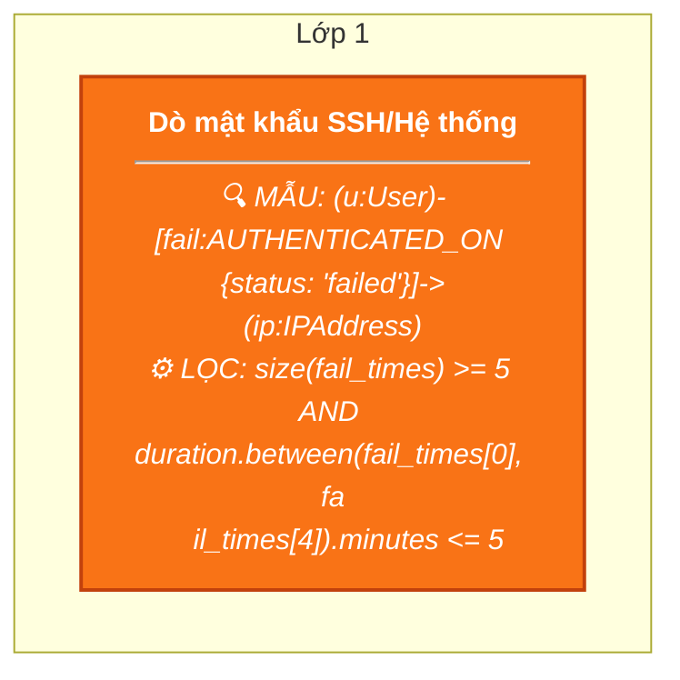

## RULE_CREDENTIAL_THEFT_SHADOW: Web/SSH Intrusion -> Process Accesses /etc/shadow or Sensitive Files
**File:** `rule_credential_theft.json`

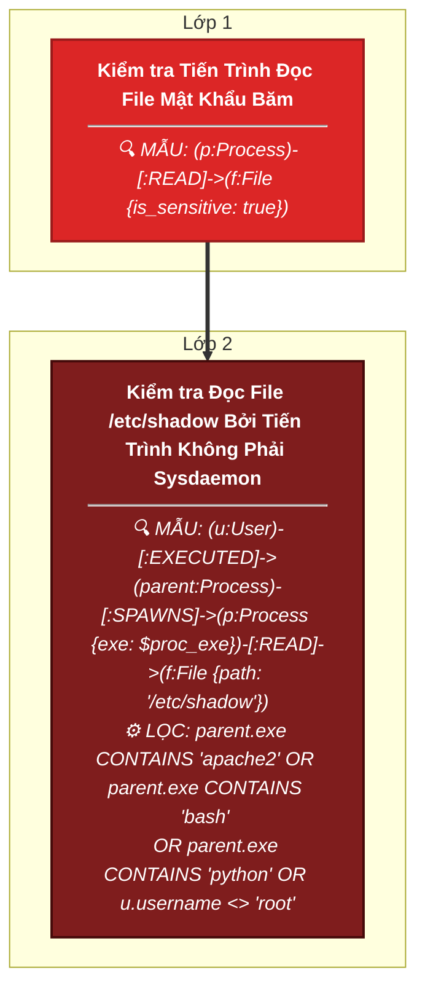

## GENERIC_ROOTKIT_MODULE: Phát hiện chung: Tải Module Nhân hệ điều hành (Rootkit/Kernel Module)
**File:** `rule_generics_combined.json`

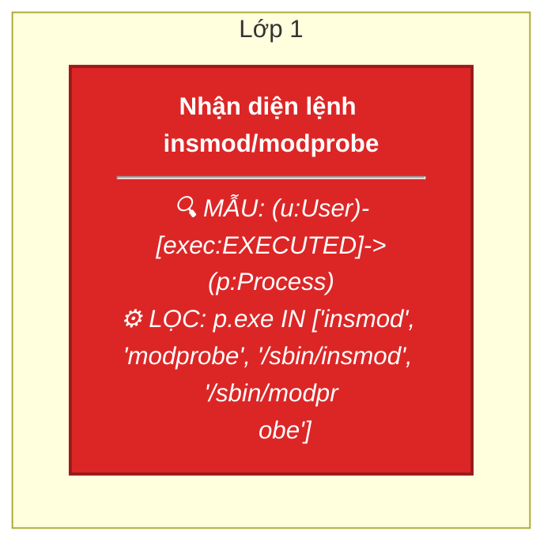

## GENERIC_SSH_PERSISTENCE: Phát hiện chung: Cấy khóa SSH trái phép (SSH Persistence)
**File:** `rule_generics_combined.json`

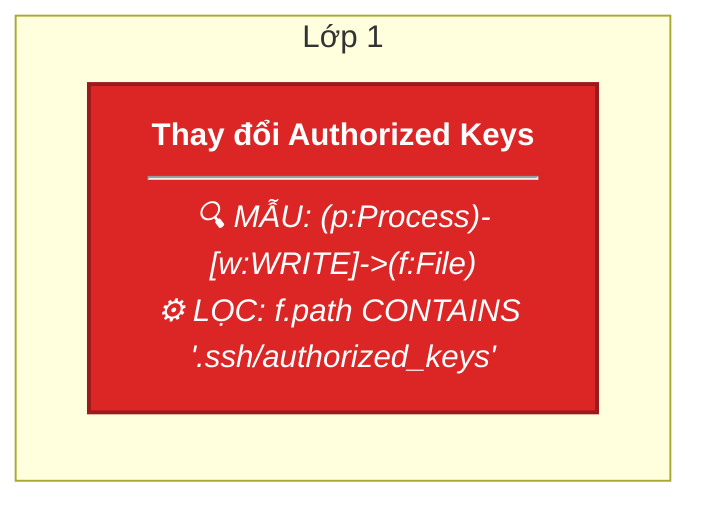

## GENERIC_FIM_PERSISTENCE: Phát hiện chung: Mã độc chạy ngầm -> Sửa đổi file hệ thống -> Gọi về máy chủ C2
**File:** `rule_generics_combined.json`

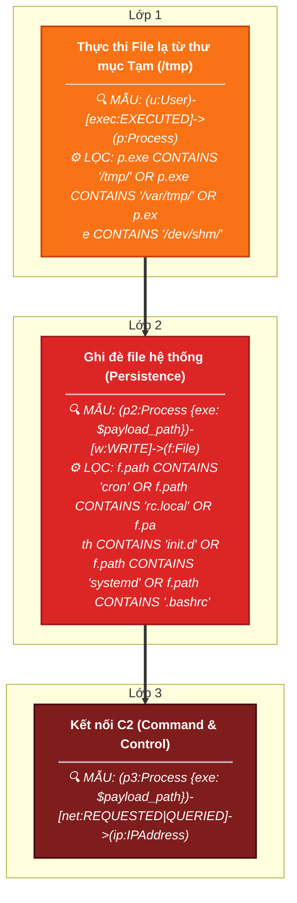

## GENERIC_DATA_STAGING: Phát hiện chung: Đóng gói dữ liệu chuẩn bị tuồn ra ngoài (Data Staging)
**File:** `rule_generics_combined.json`

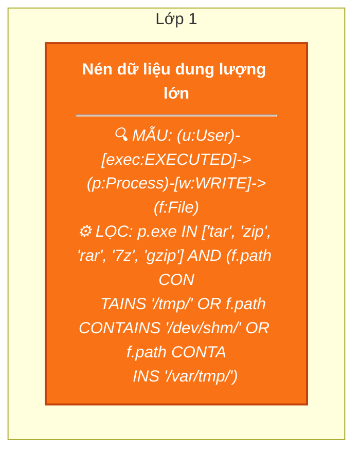

## GENERIC_DDOS_HTTP: Phát hiện chung: Tấn công từ chối dịch vụ (DoS/DDoS) qua HTTP
**File:** `rule_generics_combined.json`

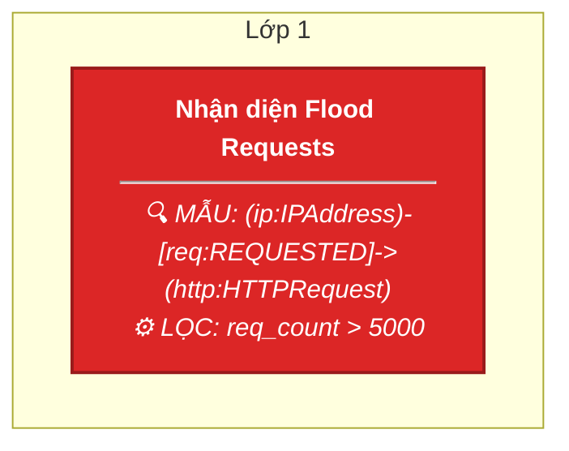

## RULE_SANTOS_DNSTEAL: Standalone DNSteal (Santos)
**File:** `rule_generics_combined.json`

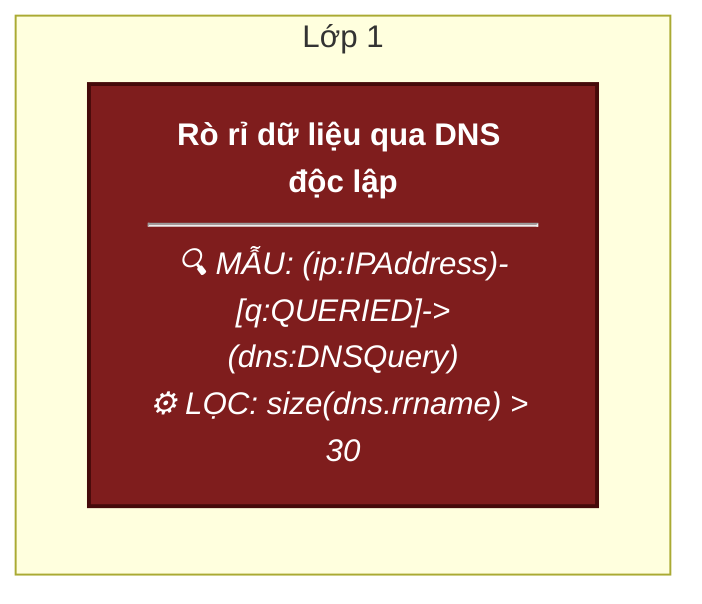

## RULE_SANTOS_PRIVESC: Standalone Privilege Escalation (Santos)
**File:** `rule_generics_combined.json`

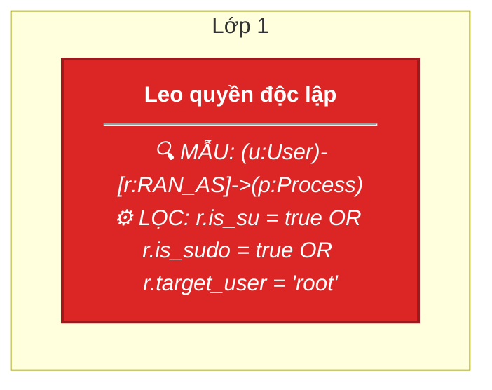

## RULE_SANTOS_CRACKING: Web/FTP Cracking Phase (Santos)
**File:** `rule_generics_combined.json`

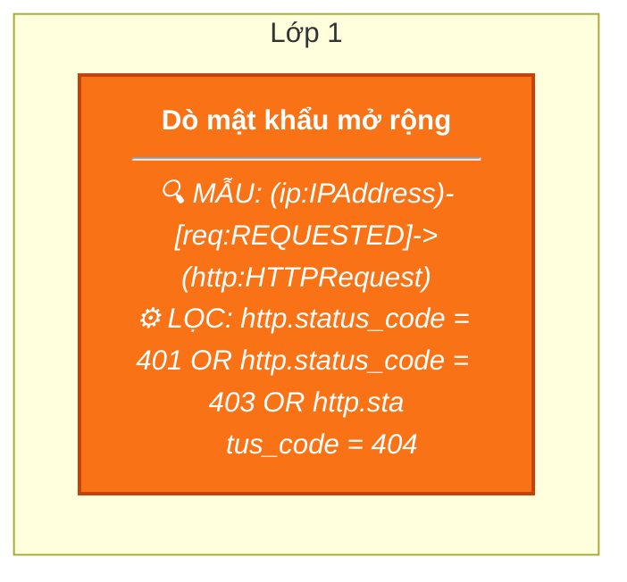

## RULE_MEGA_WEB_KILLCHAIN: Recon (Dirb) -> Webshell Upload -> RCE / Reverse Shell
**File:** `rule_mega_web_killchain.json`

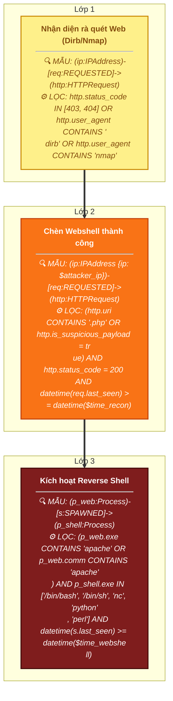

## RULE_RCE_CMD_EXECUTION_FILE_WRITE: Web Exploit -> Remote Command Execution -> File Dropped in /tmp
**File:** `rule_rce_cmd_execution.json`

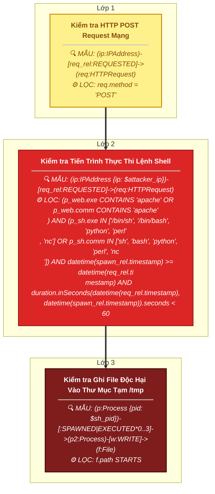

## RULE_INSIDER_THREAT_MULTI_BRANCH: WPCrack -> Privilege Escalation -> (Root Access / DNS Exfiltration)
**File:** `rule_russell_insider.json`

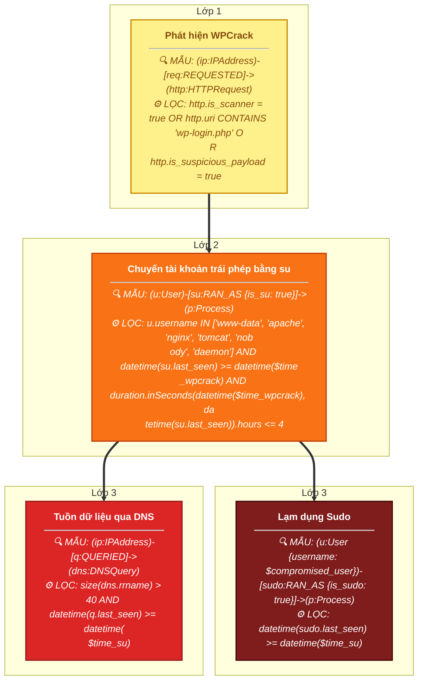

## RULE_SERVICE_EVASION: Defense Evasion (Service Stop)
**File:** `rule_service_evasion.json`

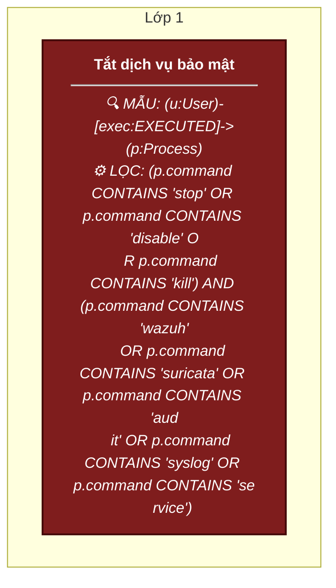

## RULE_SSH_BRUTEFORCE_TO_PIVOT: SSH Brute-force -> Successful Login -> Lateral Movement Pivot
**File:** `rule_ssh_bruteforce_pivot.json`

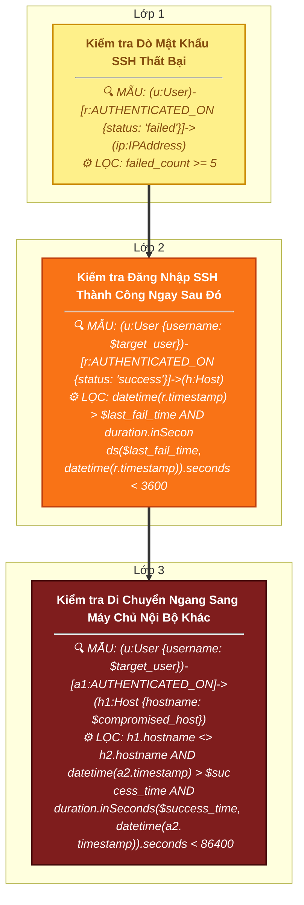

