# Hệ Thống Tập Luật Đa Nguồn (all_rules)

Dưới đây là lưu đồ tự động tạo cho các tập luật trong thư mục này.

## RULE_CREDENTIAL_THEFT_SHADOW: Web/SSH Intrusion -> Process Accesses /etc/shadow or Sensitive Files
**File:** `rule_credential_theft.json`

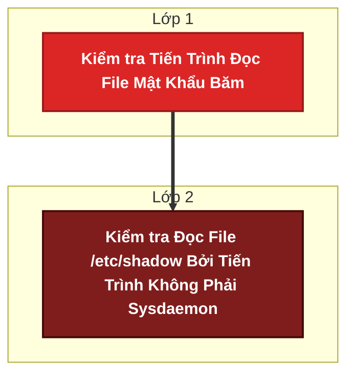

#### Chi tiết câu lệnh Cypher (Logic Detection)
**Lớp 1: Kiểm tra Tiến Trình Đọc File Mật Khẩu Băm**
```cypher
MATCH (p:Process)-[:READ]->(f:File {is_sensitive: true})
RETURN p.exe AS proc_exe, f.path AS sensitive_path
```

**Lớp 2: Kiểm tra Đọc File /etc/shadow Bởi Tiến Trình Không Phải Sysdaemon**
```cypher
MATCH (u:User)-[:EXECUTED]->(parent:Process)-[:SPAWNS]->(p:Process {exe: $proc_exe})-[:READ]->(f:File {path: '/etc/shadow'})
WHERE parent.exe CONTAINS 'apache2' OR parent.exe CONTAINS 'bash' OR parent.exe CONTAINS 'python' OR u.username <> 'root'
RETURN p.exe AS suspicious_exe, parent.exe AS spawned_by, u.username AS user
```

## RULE_CRACKING: Password Cracking Phase
**File:** `rule_generics.json`

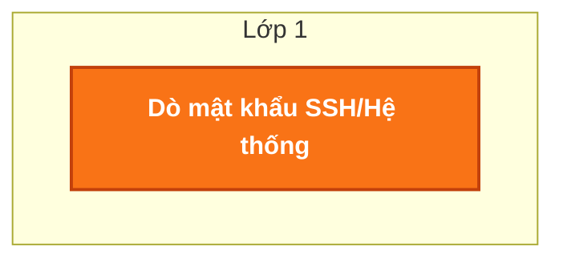

#### Chi tiết câu lệnh Cypher (Logic Detection)
**Lớp 1: Dò mật khẩu SSH/Hệ thống**
```cypher
MATCH (u:User)-[fail:AUTHENTICATED_ON {status: 'failed'}]->(ip:IPAddress) WITH ip, u, collect(datetime(fail.last_seen)) AS fail_times
WHERE size(fail_times) >= 5
  AND duration.between(fail_times[0], fail_times[4]).minutes <= 5
RETURN ip.ip AS attacker_ip, u.username AS target_user, size(fail_times) AS fails 
```

## GENERIC_SSH_PERSISTENCE: SSH Persistence
**File:** `rule_generics.json`

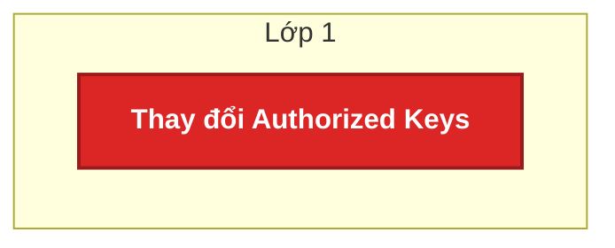

#### Chi tiết câu lệnh Cypher (Logic Detection)
**Lớp 1: Thay đổi Authorized Keys**
```cypher
MATCH (p:Process)-[w:WRITE]->(f:File)
WHERE f.path CONTAINS '.ssh/authorized_keys'
RETURN p.exe AS proc, f.path AS key_file, toString(max(datetime(w.last_seen))) AS time_mod 
```

## GENERIC_DDOS_HTTP: Phát hiện chung: Tấn công từ chối dịch vụ (DoS/DDoS) qua HTTP
**File:** `rule_generics.json`

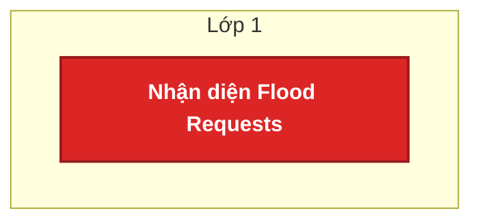

#### Chi tiết câu lệnh Cypher (Logic Detection)
**Lớp 1: Nhận diện Flood Requests**
```cypher
MATCH (ip:IPAddress)-[req:REQUESTED]->(http:HTTPRequest) WITH ip, count(req) AS req_count, max(datetime(req.last_seen)) AS last_req
WHERE req_count > 5000
RETURN ip.ip AS attacker_ip, req_count, toString(last_req) AS time_ddos 
```

## RULE_GENERICS_DNSTEAL: Standalone DNSteal
**File:** `rule_generics.json`

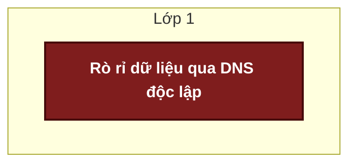

#### Chi tiết câu lệnh Cypher (Logic Detection)
**Lớp 1: Rò rỉ dữ liệu qua DNS độc lập**
```cypher
MATCH (ip:IPAddress)-[q:QUERIED]->(dns:DNSQuery)
WHERE size(dns.rrname) > 30
RETURN ip.ip AS attacker_ip, toString(max(datetime(q.last_seen))) AS time_dnsteal 
```

## RULE_GENERICS_PRIVESC: Standalone Privilege Escalation
**File:** `rule_generics.json`

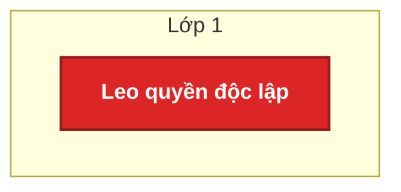

#### Chi tiết câu lệnh Cypher (Logic Detection)
**Lớp 1: Leo quyền độc lập**
```cypher
MATCH (u:User)-[r:RAN_AS]->(p:Process)
WHERE r.is_su = true OR r.is_sudo = true OR r.target_user = 'root'
RETURN u.username AS user, toString(datetime(r.last_seen)) AS time_privesc
```

## RULE_GENERICS_CRACKING: Web/FTP Cracking Phase
**File:** `rule_generics.json`

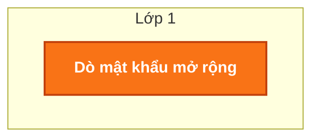

#### Chi tiết câu lệnh Cypher (Logic Detection)
**Lớp 1: Dò mật khẩu mở rộng**
```cypher
MATCH (ip:IPAddress)-[req:REQUESTED]->(http:HTTPRequest)
WHERE http.status_code = 401 OR http.status_code = 403 OR http.status_code = 404 WITH ip, count(req) AS failed_auths, max(datetime(req.last_seen)) AS time_cracking
WHERE failed_auths > 20
RETURN ip.ip AS attacker_ip, failed_auths AS fails, toString(time_cracking) AS time_cracking 
```

## RULE_SERVICE_EVASION: Defense Evasion (Service Stop)
**File:** `rule_generics.json`

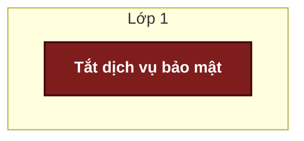

#### Chi tiết câu lệnh Cypher (Logic Detection)
**Lớp 1: Tắt dịch vụ bảo mật**
```cypher
MATCH (u:User)-[exec:EXECUTED]->(p:Process)
WHERE (p.command CONTAINS 'stop' OR p.command CONTAINS 'disable' OR p.command CONTAINS 'kill' OR p.command CONTAINS 'rm ')
  AND (p.command CONTAINS 'wazuh' OR p.command CONTAINS 'suricata' OR p.command CONTAINS 'audit' OR p.command CONTAINS 'syslog' OR p.command CONTAINS 'service' OR p.command CONTAINS 'filebeat' OR p.command CONTAINS 'ossec')
RETURN u.username AS user, p.command AS stop_cmd, toString(datetime(exec.last_seen)) AS time_service_stop
```

## RULE_MEGA_WEB_KILLCHAIN: Recon (Dirb) -> Webshell Upload -> RCE / Reverse Shell
**File:** `rule_mega_web_killchain.json`

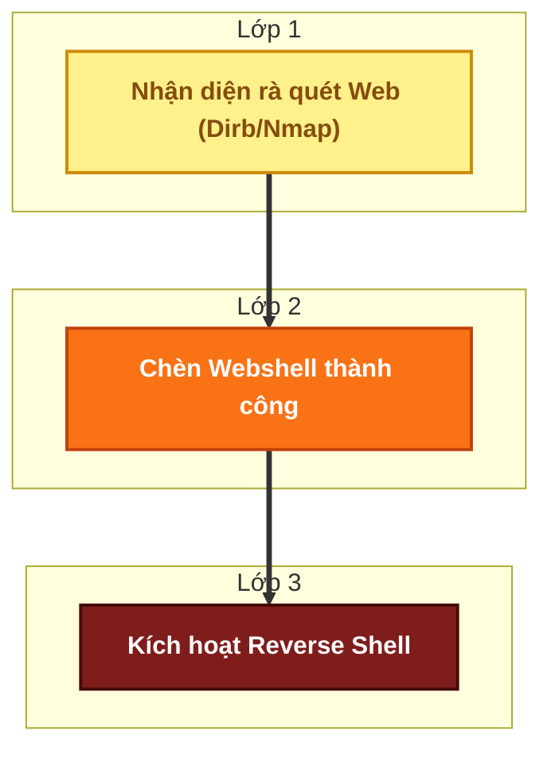

#### Chi tiết câu lệnh Cypher (Logic Detection)
**Lớp 1: Nhận diện rà quét Web (Dirb/Nmap)**
```cypher
MATCH (ip:IPAddress)-[req:REQUESTED]->(http:HTTPRequest)
WHERE http.status_code IN [403, 404] OR http.user_agent CONTAINS 'dirb' OR http.user_agent CONTAINS 'nmap' WITH ip, count(req) AS recon_count, max(datetime(req.last_seen)) AS time_recon
WHERE recon_count > 20
RETURN ip.ip AS attacker_ip, recon_count, toString(time_recon) AS time_recon ORDER BY time_recon ASC
```

**Lớp 2: Chèn Webshell thành công**
```cypher
MATCH (ip:IPAddress)-[req:REQUESTED]->(http:HTTPRequest)
WHERE (http.uri CONTAINS '.php' OR http.uri CONTAINS 'cmd' OR http.uri CONTAINS 'shell' OR http.is_suspicious_payload = true OR http.method = 'POST')
  AND (http.status_code = 200 OR http.status_code = 201 OR http.status_code = 302 OR http.status_code = 404)
  AND datetime(req.timestamp) >= datetime($time_recon) - duration('PT2H')
RETURN ip.ip AS attacker_ip_l2, http.uri AS webshell_uri, toString(max(datetime(req.timestamp))) AS time_webshell ORDER BY time_webshell ASC LIMIT 5
```

**Lớp 3: Kích hoạt Reverse Shell**
```cypher
MATCH (p_web:Process)-[s:SPAWNED]->(p_shell:Process)
WHERE (p_web.exe CONTAINS 'apache' OR p_web.comm CONTAINS 'apache' OR p_web.exe CONTAINS 'nginx' OR p_web.exe CONTAINS 'php')
  AND (p_shell.exe CONTAINS 'bash' OR p_shell.exe CONTAINS 'sh' OR p_shell.exe CONTAINS 'nc' OR p_shell.exe CONTAINS 'python' OR p_shell.exe CONTAINS 'perl' OR p_shell.comm CONTAINS 'sh' OR p_shell.comm CONTAINS 'bash')
  AND datetime(s.timestamp) >= datetime($time_webshell) - duration('PT1H')
RETURN p_shell.exe AS shell_cmd, p_shell.pid AS shell_pid, toString(max(datetime(s.timestamp))) AS time_revshell LIMIT 5
```

## RULE_RCE_CMD_EXECUTION_FILE_WRITE: Web Exploit -> Remote Command Execution -> File Dropped in /tmp
**File:** `rule_rce_cmd_execution.json`

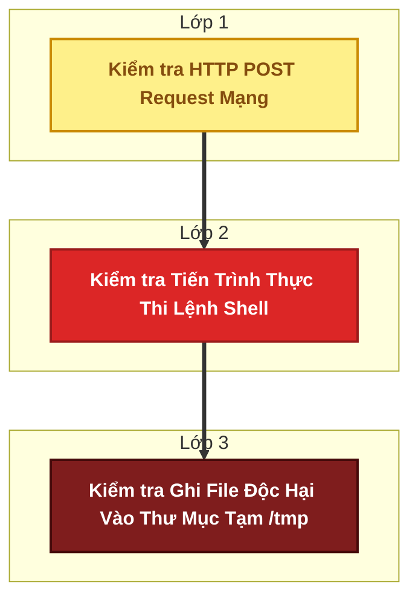

#### Chi tiết câu lệnh Cypher (Logic Detection)
**Lớp 1: Kiểm tra HTTP POST Request Mạng**
```cypher
MATCH (ip:IPAddress)-[req_rel:REQUESTED]->(req:HTTPRequest)
WHERE req.method = 'POST'
RETURN ip.ip AS attacker_ip, toString(max(datetime(req_rel.timestamp))) AS time_post
```

**Lớp 2: Kiểm tra Tiến Trình Thực Thi Lệnh Shell**
```cypher
MATCH (ip:IPAddress {ip: $attacker_ip})-[req_rel:REQUESTED]->(req:HTTPRequest) MATCH (p_web:Process)-[spawn_rel:SPAWNED]->(p_sh:Process)
WHERE (p_web.exe CONTAINS 'apache' OR p_web.comm CONTAINS 'apache')
  AND (p_sh.exe IN ['/bin/sh', '/bin/bash', 'python', 'perl', 'nc'] OR p_sh.comm IN ['sh', 'bash', 'python', 'perl', 'nc'])
  AND datetime(spawn_rel.timestamp) >= datetime(req_rel.timestamp) - duration('PT1H')
RETURN p_sh.exe AS sh_exe, p_sh.pid AS sh_pid, toString(max(datetime(spawn_rel.timestamp))) AS time_rce
```

**Lớp 3: Kiểm tra Ghi File Độc Hại Vào Thư Mục Tạm /tmp**
```cypher
MATCH (p:Process {pid: $sh_pid})-[:SPAWNED|EXECUTED*0..3]->(p2:Process)-[w:WRITE]->(f:File)
WHERE f.path STARTS WITH '/tmp/' OR f.path STARTS WITH '/var/tmp/'
RETURN f.path AS dropped_file, toString(max(datetime(w.timestamp))) AS time_drop
```

## RULE_INSIDER_THREAT_MULTI_BRANCH: WPCrack -> Privilege Escalation -> (Root Access / DNS Exfiltration)
**File:** `rule_russell_insider.json`

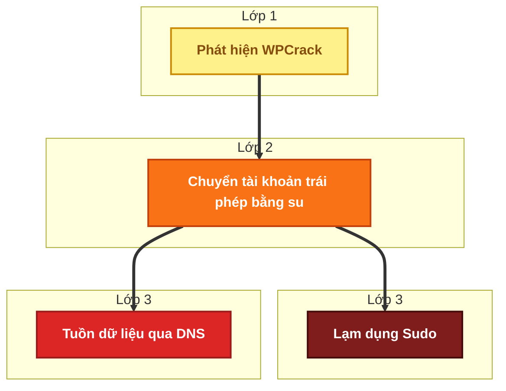

#### Chi tiết câu lệnh Cypher (Logic Detection)
**Lớp 1: Phát hiện WPCrack**
```cypher
MATCH (ip:IPAddress)-[req:REQUESTED]->(http:HTTPRequest)
WHERE http.is_scanner = true OR http.uri CONTAINS 'wp-login.php' OR http.is_suspicious_payload = true WITH ip, max(datetime(req.last_seen)) AS time_wpcrack
RETURN ip.ip AS attacker_ip, toString(time_wpcrack) AS time_wpcrack 
```

**Lớp 2: Chuyển tài khoản trái phép bằng su**
```cypher
MATCH (u:User)-[su:RAN_AS]->(p:Process)
WHERE (su.is_su = true OR su.is_sudo = true OR su.target_user = 'root')
  AND datetime(su.last_seen) >= datetime($time_wpcrack) - duration('PT1H')
RETURN u.username AS original_user, su.target_user AS compromised_user, toString(max(datetime(su.last_seen))) AS time_su
```

**Lớp 3: Lạm dụng Sudo**
```cypher
MATCH (u:User {username: $compromised_user})-[sudo:RAN_AS {is_sudo: true}]->(p:Process)
WHERE datetime(sudo.last_seen) >= datetime($time_su)
RETURN sudo.command AS root_command, toString(max(datetime(sudo.last_seen))) AS time_sudo
```

**Lớp 3: Tuồn dữ liệu qua DNS**
```cypher
MATCH (ip:IPAddress)-[q:QUERIED]->(dns:DNSQuery)
WHERE size(dns.rrname) > 40
  AND datetime(q.last_seen) >= datetime($time_su) WITH ip, count(q) AS dns_count, max(datetime(q.last_seen)) AS time_dns
WHERE dns_count > 5
RETURN ip.ip AS exfil_ip, dns_count, toString(time_dns) AS time_dns
```

## RULE_SSH_BRUTEFORCE_TO_PIVOT: SSH Brute-force -> Successful Login -> Lateral Movement Pivot
**File:** `rule_ssh_bruteforce_pivot.json`

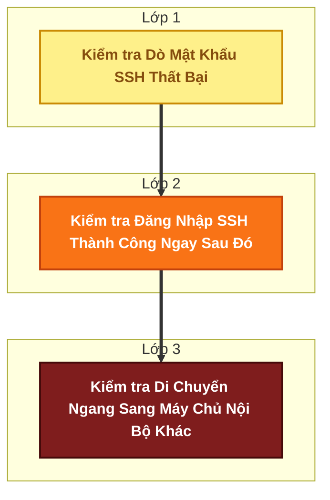

#### Chi tiết câu lệnh Cypher (Logic Detection)
**Lớp 1: Kiểm tra Dò Mật Khẩu SSH Thất Bại**
```cypher
MATCH (u:User)-[r:AUTHENTICATED_ON {status: 'failed'}]->(ip:IPAddress) WITH u, ip, count(r) AS failed_count, max(datetime(r.timestamp)) AS last_fail_time
WHERE failed_count >= 5
RETURN ip.ip AS attacker_ip, u.username AS target_user, failed_count, last_fail_time
```

**Lớp 2: Kiểm tra Đăng Nhập SSH Thành Công Ngay Sau Đó**
```cypher
MATCH (u:User {username: $target_user})-[r:AUTHENTICATED_ON {status: 'success'}]->(h:Host)
WHERE datetime(r.timestamp) > $last_fail_time
  AND duration.inSeconds($last_fail_time, datetime(r.timestamp)).seconds < 3600
RETURN h.hostname AS compromised_host, max(datetime(r.timestamp)) AS success_time
```

**Lớp 3: Kiểm tra Di Chuyển Ngang Sang Máy Chủ Nội Bộ Khác**
```cypher
MATCH (u:User {username: $target_user})-[a1:AUTHENTICATED_ON]->(h1:Host {hostname: $compromised_host}) MATCH (u)-[a2:AUTHENTICATED_ON]->(h2:Host)
WHERE h1.hostname <> h2.hostname
  AND datetime(a2.timestamp) > $success_time
  AND duration.inSeconds($success_time, datetime(a2.timestamp)).seconds < 86400
RETURN h1.hostname AS src_host, h2.hostname AS dest_host
```

