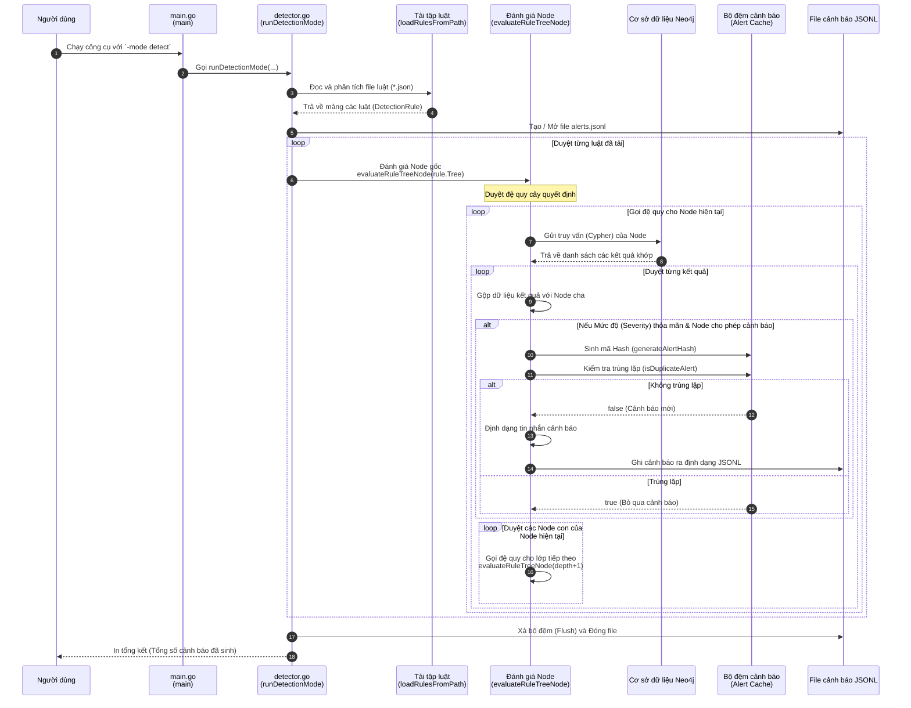

# Sơ đồ trình tự luồng quét (Detection Flow)

Sơ đồ trình tự này mô tả luồng thực thi khi chạy công cụ ở **chế độ quét** (`-mode detect`). Nó bao gồm từ bước phân tích tập luật cho đến khi thực thi các truy vấn Cypher đệ quy và lọc trùng lặp cảnh báo.

## Các cơ chế chính:
1. **Phân tích tập luật:** Các luật (Rules) là những file JSON chứa truy vấn Cypher được tổ chức dưới dạng cây quyết định (Cha -> Con -> Cháu).
2. **Đánh giá đệ quy:** Những kết quả khớp từ Node cha sẽ được truyền xuống làm tham số (`params`) cho các câu truy vấn Cypher của Node con. Cơ chế này cho phép theo dõi trạng thái xuyên suốt của một chuỗi tấn công (kill-chain).
3. **Bộ đệm cảnh báo (Chống trùng lặp):** Một mã Hash được sinh ra dựa trên ID của Luật, ID của Node và chi tiết của truy vấn (`details`). Nếu hệ thống bắt gặp một Hash giống hệt trong khoảng thời gian hiệu lực (TTL - mặc định 24h), cảnh báo đó sẽ bị loại bỏ để tránh gây tràn ngập màn hình (alert flooding).
